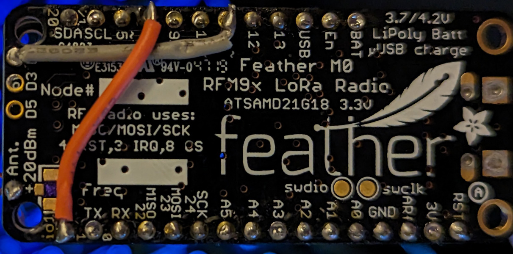

# simple-feather-m0-rfm95-tracker
 Simple gps tracker that uses Adafruit Feather M0 with RFM95.

## Hardware:  
Feather M0 w/ RFM95: https://www.adafruit.com/product/3178  
Featherwing GPS Hat: https://www.adafruit.com/product/3133

You will have to added these wires to properly conenc IO pins from RFM95 to microcontroller:

# Requires these packages:
LoRa library: lmic - https://github.com/mcci-catena/arduino-lmic  
GPS Library: TinyGPSPlus - https://github.com/mikalhart/TinyGPSPlus  
Library to store info in program memory: FlashStorage - https://github.com/cmaglie/FlashStorage